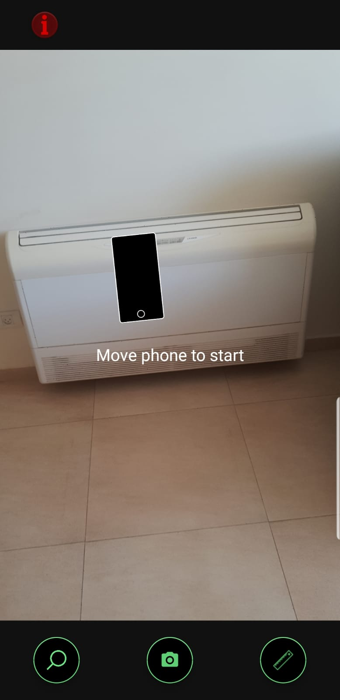
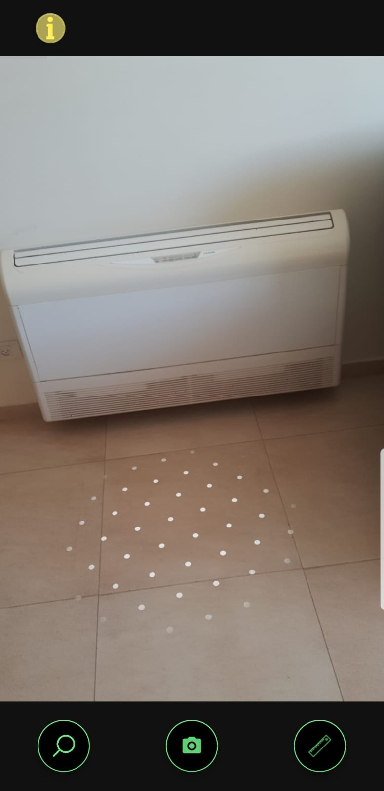
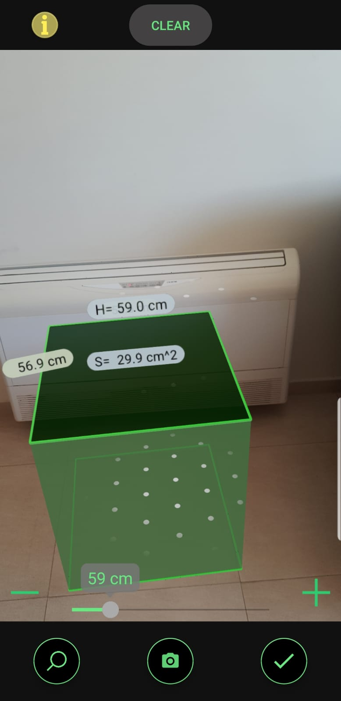
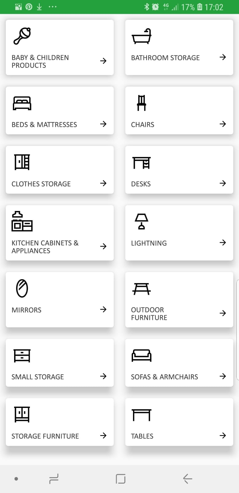
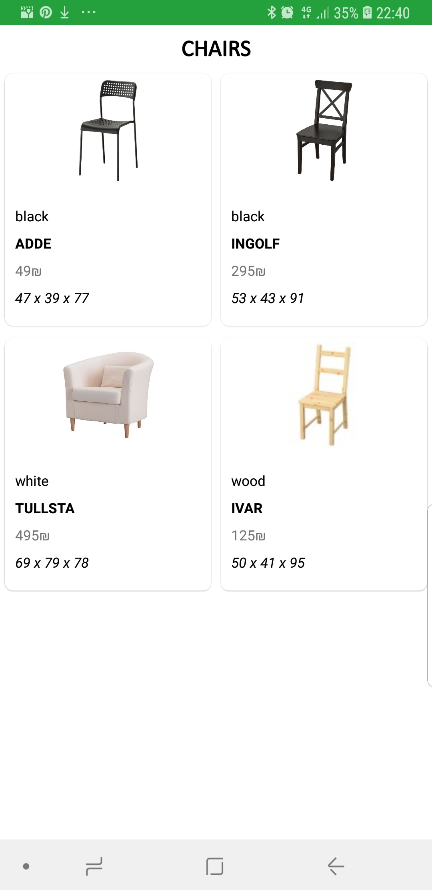
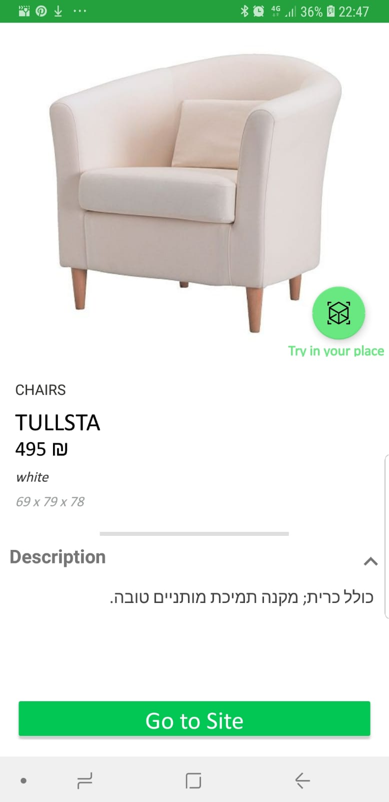
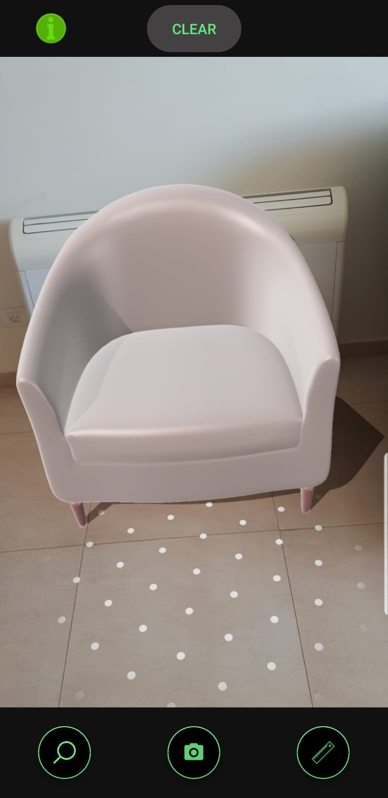
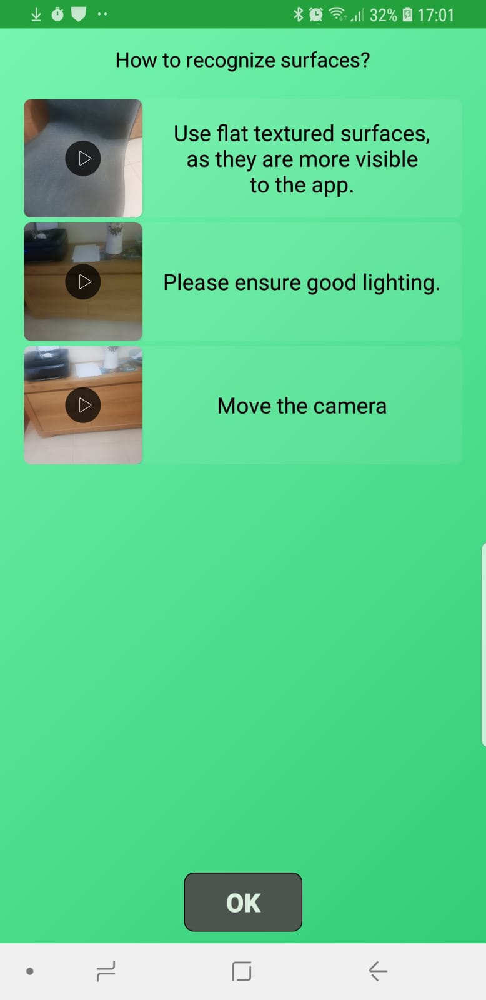
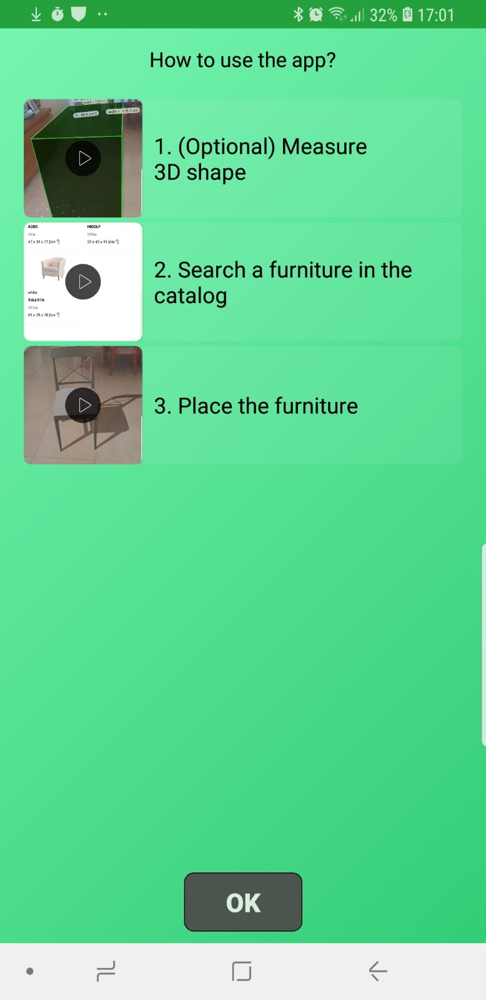

# AR furniture planner

 Welcome to AR furniture planner!

1. Install Android studio / do not update gradle or any other available upgrades.
2. build the project. (ignore warning/ only error matters)
3. create virtual mobile with below requirements in emulator.
4. Run the project. 


AR furniture planner is an augmented reality furniture design planner app similar to IKEA.
AR furniture planner lets you place 3D models in your place.
By utilizing ARCore and SceneForm libraries by google it allows you to visualize how furniture would fit 
to your home without ever going to the shop.

AR furniture planner is the final project in the jain university in bengaluru.

## Features
- Measuring real world  location.
- Searching furniture with  maximum measurements.
- Placing 3D model of real furniture at home.
- Taking picture/ video of model at your home.
- help page showing how to use the app

## Supported devices
[https://developers.google.com/ar/discover/supported-devices](https://developers.google.com/ar/discover/supported-devices)
 ________________  ___________  _  _____________   _________________ ____________________  _____ _______
 ______________ ________  ____ _____ ___ _ _ _________ ___________ ____________ ______ ________ _______

use only specified version of os_image in android studio`s emulator.
--- API level 30 - X86 architecture- Nexus 5X (google play)

**** API 30 (recommended) /android 11.0 google play supported version ***** 
in emulator advanced settings set front camera -> none and back camera -> Webcam().
After starting the emulator and nexus 5x install the "GOOGLE ARCORE service" app from google play.
then build the project file once before running in the android emulator after build -> in reports 
*IGNORE* any and all warnings if the BUILD SUCCESSFUL and all 28 actionable tasks are executed.

use well lit environment and prefer white tiles > .

## List of tools used

1. unity.
2. Blender - use this for ease
3. ARCore.
4. Android studio.

______________________ go to PRIVACYPOLICYFRAG.KT to set terms/condition & privacy policy link ( ln: 15 --- private val URL_USAGE_TERMS = "<link>" )


## Demo


## Screenshots

### Main page searching for plane

### Main page plane discovered

### Main page measuring 3d box

### Furniture Catalog main papge

### Item catalog by category screen

### Item description screen

### The model has been placed!!

### Help page 1

### Help page 2



## project structure
```
.
*********** ├── ar *********** arcore related logic

│├── CameraFacingNode.kt                 # a type of node always facing the camera
│└── MyArFragment.kt                     # custom arframgent 

*********** ├── catalog *********** contains the catalog screens logic

|├── CatalogFrontActivity.kt             # main page of the catalog(the one with the categories)
│├── DepartmentActivity.kt               # department page activity
│├── Department.kt                       # department item 
│├── DepartmentRecyclerAdapter.kt        # department adapter
│├── DepartmentSourceData.kt             # holds the department images
│├── Furniture.kt                        # data class representing a furniture
│├── ItemDetailsActivity.kt              # activity showing details about ites. Also allows downloading a model to show
│├── ItemRecyclerAdapter.kt              # recycle adapter for items
│└── LoadingDialogFragment.kt            # loading aimation fragment

*********** ├── greetings *********** contains logic regearding screens displaying on first app usage

│├── AboutAppFrag.kt                     # fragemnt showing details about the app
│├── AppDescriptionFrag.kt               # show how to use the app
│├── AppTechnicalDescriptionFrag.kt      # shows technical notes regardign ar
│├── GreetingActivity.kt                 # the activity showed to the user on first usage
│├── HomeFrag.kt                         # first page  showed in the greetnig fragment
│├── ObservableWebView.java              # webview custom used to show the privacy notes
│├── PrivacyPolicyFrag.kt                # fragments show the privacy policy
│├── SquareImageButton.java              # sqaure image button.Extends Button class
│└── VideoAppFrag.kt                     # video framenget of the video 
                                           shown to the user in the greetings pages

*********** ├── Help *********** use help activit'ies related logic.

│├── HelpActivity.kt                     # actvity that disaplys usage help to the user
│├── HelpDescriptionFrag.kt              # show how to use the app
│├── HelpTechnicalDescriptionFrag.kt     # shows technical notes regarding the  ar
│└── HelpVideoFrag.kt                    # video fragment of the videos shown to the user in the help pages

*********** ├── InfoFAB.kt *********** the infolab shows no the camera activity.Top left panel
├── MeasurementBox.kt                       # holds logic regearding creating the 3d cube used to measure a real world 3d spaces.
├── OpenCameraActivity.kt                   # the main activity.Holds the AR logic

*********** └── utils *********** utility classes
    ├── PhotoSaver.kt                       # saves ar scene photo
    └── VideoRecorder.java                  # records ar scene video
```

## 3D models
Our app uses Firebase as backend.

The models were takes from multiple sources.
They were preprocessed using blender software and uploaded to firebase using python.
See : https://github.com/arikzilWork/CouchMirageFirebaseLoader

### List of 3d models sources
    * https://free3d.com/3d-models/ikea

    * https://www.polantis.com/ikea/arstid-wall-lamp

    * https://www.turbosquid.com/Search/3D-Models/free/ikea

    * https://clara.io/view/615465b6-822c-4e2a-9b7d-e77b816001a7#

    * https://sketchfab.com/tags/ikea

    * http://www.proviz.info/blog3dfreemodels/3dmodels-ikeafalster

    * http://ikea.csail.mit.edu/

    * https://3dbrute.com/33-ikea-sofa/

    * https://cgtricks.com/high-quality-3d-models-ikea-proviz/

    * https://3dwarehouse.sketchup.com/collection/ue790c74c-6a82-4077-92cd-7f6d2a5f1661/ikea?sortBy=createTime%20DESC&searchTab=model&hl=en&login=true

    * https://3dwarehouse.sketchup.com/collection/c03129ceab823647aac2578a7b9ddb8c/2-IKEA-SOFA?sortBy=createTime%20DESC&searchTab=model&hl=en

    * https://cgdownloads.com/download-slect-ikea-slakt-ikea-3d-model-free/

    * http://www.cgchannel.com/2014/03/download-10-free-models-of-ikea-furniture-from-proviz/

    * https://archibaseplanet.com/download/6f86e1ec.html